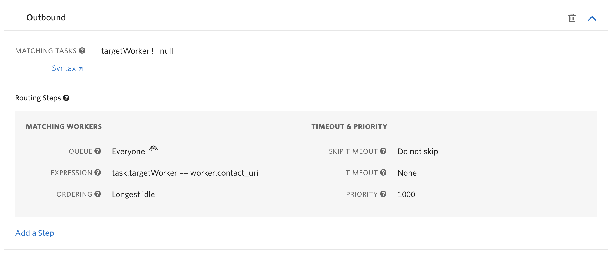

# Native Flex Dialpad Add-on for Agent to Agent (Internal) Call

# Internal call

This feature adds a new "Call Agent" section to the outbound dialpad allowing an agent to directly call another agent. In this section, there is an autocomplete dropdown where you can select the agent you want to call.

This feature is based on [the dialpad addon plugin](https://github.com/twilio-professional-services/flex-dialpad-addon-plugin).

# flex-user-experience


# setup and dependencies

## Outbound Call Configuration

When placing the internal call, the default outbound call settings are used. If this has not yet been configured, you will encounter errors. This can be updated using the Flex Configuration API:

```
POST https://flex-api.twilio.com/v1/Configuration
Authorization: Basic {base64-encoded Twilio Account SID : Auth Token}
Content-Type: application/json

{
  "account_sid": "Enter your Twilio Account SID here",
  "outbound_call_flows": {
    "default": {
      "workflow_sid": "WWxxxc",
      "enabled": true,
      "queue_sid": "WQxxx",
      "caller_id": "+1xxx",
      "location": "US"
    }
  },
}
```

## TaskRouter

Before using this plugin you must first create a dedicated TaskRouter workflow or just add the following filter to your current workflow. Make sure it is part of your Flex Task Assignment workspace.

- ensure the following matching worker expression: _task.targetWorker==worker.contact_uri_
- ensure the priority of the filter is set to 1000 (or at least the highest in the system)
- make sure the filter matches to a queue with Everyone on it. The default Everyone queue will work but if you want to seperate real time reporting for outbound calls, you should make a dedicated queue for it with a queue expression _1==1_



In the `serverless-functions/.env` file, be sure to set `TWILIO_FLEX_INTERNAL_CALL_WORKFLOW_SID` to the SID of the workflow configured above (and set `TWILIO_FLEX_WORKSPACE_SID` if it has not been already).

# Flex Plugin

This repository is a Flex plugin with some other assets. The following describing how you setup, develop and deploy your Flex plugin.

### Setup

Make sure you have [Node.js](https://nodejs.org) as well as [`npm`](https://npmjs.com) installed.

Afterwards, install the dependencies by running `npm install` at both 'root` and `ui-src` directory of the project:

```bash
cd

# If you use npm
npm install
```

### Development

In order to develop locally, you can use the Twilio CLI to run the plugin locally. Using your commandline run the following from the root dirctory of the plugin.

```bash
twilio flex:plugins:start
```

This will automatically start up the Webpack Dev Server and open the browser for you. Your app will run on `http://localhost:3000`.

When you make changes to your code, the browser window will be automatically refreshed.

### Deploy

#### Plugin Deployment

Once you are happy with your plugin, you have to deploy then release the plugin for it to take affect on Twilio hosted Flex.

Rename `.env.example` at root of the project to `.env` , And fill the values as shown below:

```
TWILIO_FLEX_WORKSPACE_SID==<YOUR_WORKSPACE_SID>
TWILIO_FLEX_INTERNAL_CALL_WORKFLOW_SID=<YOUR_FLEX_INTERNAL_CALL_WORKFLOW_SID>
```

Once the .env values are set, Start serverless deployment with below command at `root` of your project:

```bash
twilio serverless:deploy
```
Rename `.env.example` inside `ui-src` folder to `.env`.
If the serverless deployment was successful, you must see the Domain url which ends with `.twil.io`.
Copy the entire domain url and add that inside `.env` file of `ui-src` folder.

```
FLEX_APP_SERVERLESS_FUNCTONS_DOMAIN=<DOMAIN_URL>
```

Run the following command on `ui-src` folder to start the deployment:

```bash
twilio flex:plugins:deploy --major --changelog "Notes for this version" --description "Functionality of the plugin"
```

After your deployment runs you will receive instructions for releasing your plugin from the bash prompt. You can use this or skip this step and release your plugin from the Flex plugin dashboard here https://flex.twilio.com/admin/plugins

For more details on deploying your plugin, refer to the [deploying your plugin guide](https://www.twilio.com/docs/flex/plugins#deploying-your-plugin).

Note: Common packages like `React`, `ReactDOM`, `Redux` and `ReactRedux` are not bundled with the build because they are treated as external dependencies so the plugin will depend on Flex to provide them globally.

## Twilio Serverless

You will need the [Twilio CLI](https://www.twilio.com/docs/twilio-cli/quickstart) and the [serverless plugin](https://www.twilio.com/docs/labs/serverless-toolkit/getting-started) to deploy the functions inside the `serverless` folder of this project. You can install the necessary dependencies with the following commands:

`npm install twilio-cli -g`

and then

`twilio plugins:install @twilio-labs/plugin-serverless`


# how does it work?

After selecting and clicking the call button, the WorkerClient's createTask method is used to create the outbound call task having the caller agent as target. When the task is sent to this agent, the AcceptTask action is overridden so we can control all the calling process. Then, we use the reservation object inside the task payload to call the caller agent. This reservation object is part of the TaskRouter JavaScript SDK bundled with Flex. The URL endpoint of this call is used and pointed to a Twilio Function that returns TwiML which in turn creates a conference and sets the statusCallbackEvent. The latter endpoint will be used to create the called agent task.

On the called agent side, the AcceptTask action is also overridden and a similar calling process is done. The difference is that the URL endpoint points to a different Twilio Function that returns simple TwiML which in turn calls the conference created on the caller side.

# Known issues

1. When in an agent-to-agent call, the internal transfer button is hidden, as Flex does not handle this scenario correctly.
2. When in an agent-to-agent call, an external transfer is done correctly, but the UI does not reflect what is going on.
